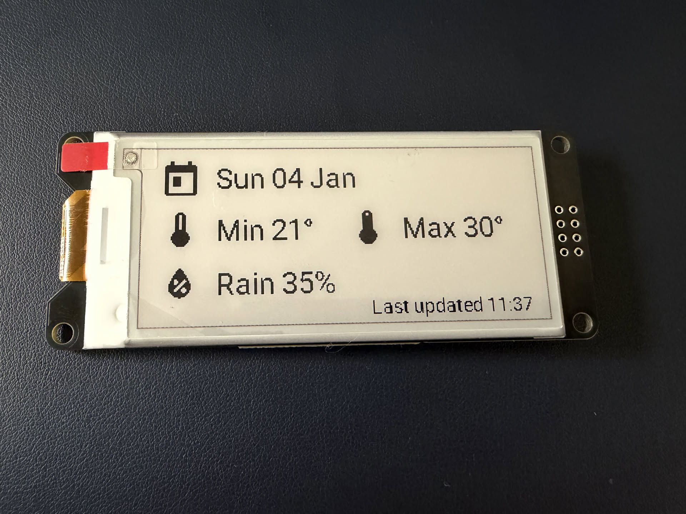
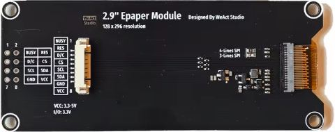
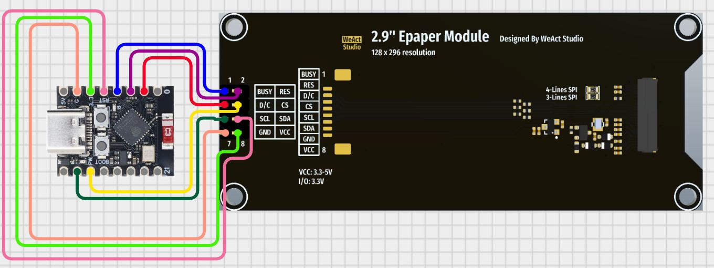
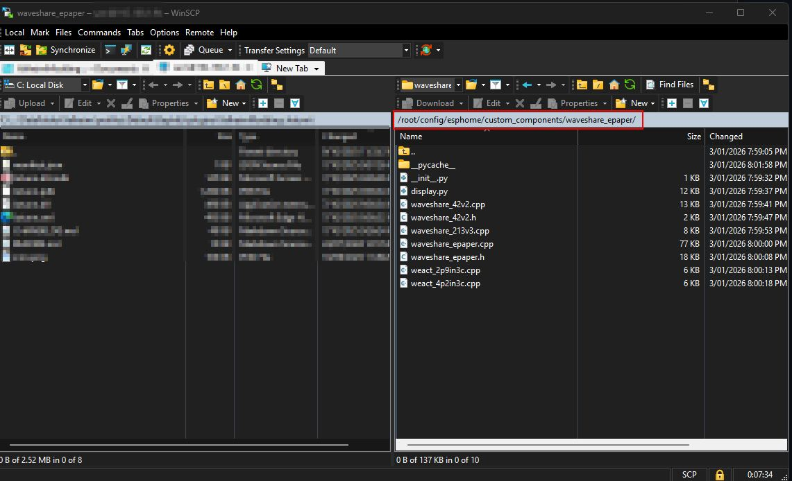

# ESPHome 2.9" WeAct ePaper Weather Display (ESP32‑C3) 🌦️

A simple, **low-power** ePaper display that shows:
- 📅 Date (Day-of-week / Day / Month)
- 🌡️ Min + Max temperature
- 💧 Chance of rain (turns 🔴 red at ≥50%)
- 🕒 “Last updated HH:MM” (bottom-right)



Built with **ESPHome** + **Home Assistant** sensors (this repo uses **WillyWeather** as an example, but should be easy enough to use something else).

---

## ✅ What you need (parts list)

### Hardware
- **ESP32‑C3 Super Mini**
- **WeAct 2.9" tri-colour ePaper module** (black/white/red) - [AliExpress Link](https://www.aliexpress.com/item/1005004644515880.html?spm=a2g0o.store_pc_home.promoteWysiwyg_6000122603282.1005004644515880)
  - You can use a black and white option, you just won't get the red colour for when the rain chance is above 50%)

#### Optional Hardware
- Jumper wires
- Breadboard (For initial testing)
- JST connectors
- Soldering iron
- 3D printer for case

### Software
- Home Assistant + ESPHome Builder add-on
- A weather integration that exposes forecast sensors. This guide uses Willy Weather via a [HACS Integration](https://github.com/safepay/willyweather-forecast-home-assistant/tree/master), and while not free, shouldn't cost more than a few dollars per month dependant on your configuration.

---

## 🔌 Wiring (ESP32‑C3 → WeAct 2.9")

This build uses:

| WeAct ePaper Pin | ESP32‑C3 Pin | Notes |
|---|---:|---|
| BUSY | GPIO3 | Busy signal |
| RES | GPIO2 | Reset *(GPIO2 is a strapping pin—see note below)* |
| D/C | GPIO1 | Data/Command |
| CS | GPIO7 | Chip select |
| SCL | GPIO6 | SPI MOSI |
| SDA | GPIO4 | SPI clock |
| GND | GND | Ground |
| VCC | 3V3 | Use **3.3V** (recommended for ESP32) |

### Back of device
It's possible to use either the included jumpers, or solder the ports direct. If you use the jumpers, the order is as per the above table, or in the image below. Should you choose to solder it, note the wiring diagram further below under Wiring Diagram.



### Wiring Diagram



---

## 🌤️ Step 1 — Install a weather integration in Home Assistant

This repo uses the **WillyWeather forecast integration** as an example:
- Repo: `safepay/willyweather-forecast-home-assistant`

✅ Install it by going to this repo and following instructions - [willyweather-forecast-home-assistant](https://github.com/safepay/willyweather-forecast-home-assistant/tree/master)

Once installed, confirm you have entities like:
- `sensor.<something>_min_temperature_0`
- `sensor.<something>_max_temperature_0`
- `sensor.<something>_rain_probability_0`

> **Important:** Your entity names **WILL be different** depending on your location and integration. That’s expected.

### Find your entity IDs
Home Assistant → **Developer Tools** → **States** → search for:
- `min_temperature`
- `max_temperature`
- `rain_probability`
- or your chosen weather integration prefix.

Remember these, as they will need to be put into the code later.

---

## 🧩 Step 2 — Add the WeAct ePaper custom component

### NOTE - This is only a work around until the components are built into ESPHome directly.

Steps taken from [RaceNJason/WeAct-Studio_ePaper](https://github.com/RaceNJason/WeAct-Studio_ePaper). Also here - [Home Assistant Forum post](https://community.home-assistant.io/t/weact-studio-epaper-screens/916008)

- Go to the repo, then click on the green Code button, then download ZIP. Extract that zip then move to the next step.

### Install instructions
While there are many ways to do this, one of the easiest is to download and install WinSCP, and move files this way.

Once WinSCP is downloaded and installed, create a new connection to your Home Assistant Server. Use your Home Assistant admin account as your credentials to connect.

1. Create this folder if it doesn’t exist:
   - `config/esphome/custom_components/waveshare_epaper/`

2. Copy the contents of the "custom_components/waveshare_epaper" folder to the folder you created above. It should now look the same as the screenshot below.



---

## 🧠 Step 3 — Create the ESPHome device

In ESPHome Builder:
1. New Device, then select New Device again.
2. Give the device a name
3. It will ask you to connect the device. Note - You will need a valid SSL cert on Home Assistant to be able to connect and manage devices from your own PC. If you don't have that, or simply don't want to configure it, you can connect the ESP32 directly to your Home Assistant Server.
4. NOTE - Occasionally you will need to hold down the BOOT button while installing.
5. Once the device has the base ESPHome config, proceed to the next step!

---

## 🧾 Step 4 — Use the YAML config (copy/paste)

In ESPHome Builder, select the device then press edit.

1. Copy and paste on_boot (And everything under it) to the esphome section. Example:

```yaml
#esphome:
# name: test-esp32-c3
# friendly_name: test-esp32-c3
  on_boot:
    priority: 600
    then:
      - delay: 2s
      - script.execute: boot_retry_refresh
```

2. Open this link - [ESP Home Config](ESPHome-Code/v1.yaml)
3. Copy and paste the content underneath `captive_portal:`

---

## 🚀 Step 5 — Flash + verify

1. While in ESPHome Builder, press edit.
2. Ensure the config is saved, then press install.
3. Choose method for installation.
4. Wait while the config is installed.

At initial boot, the screen will refresh and show a waiting for data screen. After 60 seconds, it will refresh again and the data should show correctly.

---

## Tested with
- ESP32-C3 Super Mini (USB-C)
- WeAct 2.9" tri-colour ePaper
- ESPHome 2025.12

## Known limitations
- Screen refresh is slow by design (ePaper)
- Red colour only works on tri-colour panels
- Requires Home Assistant to be available at boot

### Future ESPHome support

This custom component is currently required as a workaround.

There is an open pull request to add native WeAct ePaper support directly into ESPHome.  
Once merged, this guide will be updated to remove the custom component requirement.

---

#  Credits

This project is primarily **configuration + wiring guidance**. It references upstream projects you must install separately.

## Home Assistant Weather Integration
- **[WillyWeather forecast integration](https://github.com/safepay/willyweather-forecast-home-assistant/tree/master)** by `safepay`
## WeAct ePaper ESPHome custom component
- **[WeAct-Studio_ePaper](https://github.com/RaceNJason/WeAct-Studio_ePaper)** by `RaceNJason`.
- Original pull request by `jbergler` here - **[ESPHome Pull Request #6226](https://github.com/esphome/esphome/pull/6226)**


## ⚠️ Disclaimer

This project is provided “as-is”. You are responsible for safe wiring, power supply choices, and verifying compatibility with your specific hardware.
